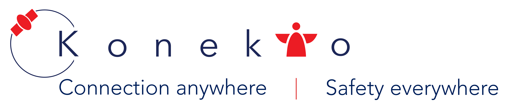

# Konekto - MPD Spring 2019


We are Team Konekto. We've developed a solution with our partner Airbus which enables our customers to send out emergency requests from anywhere.

## What's this project about?
During the 12 week course "Managing Product Development (MPD)" at the Center of Digital Technology and Management, we have developed Konekto. Our task was to come up with an idea, build a product demo and also create a business model around it. At the end we have pitched our product in front of 300 people. 

## How to run it?

This repository contains the code of our product demo. For documentation purpose we dockerized the product demo so that it's easier to setup. The product demo consists of two frontends (patient and rescue team), one backend and one database (MongoDB).

### 1. Install docker
In order to run, you have to install [Docker](https://docs.docker.com/install/) first. Follow the link and install the right version of Docker for your operating system.

### 2. Clone or download the code

Clone: ``` git clone git@github.com:JanRuettinger/mpd_konekto.git```  
Download: ```https://github.com/JanRuettinger/mpd_konekto/archive/master.zip```

### 3. Run the code
Open your terminal and change directory to the mpd_konekto folder. Then you can just run ```docker-compose up```. This will start up four Docker containers (2 frontends, 1 backend and 1 database container).

### 4. Access the demo
Open your browser and type if the following:
- Frontend Patients: ```localhost:3000```
- Frontend Rescue Team: ```localhost:3001```

### 5. Accessing the app from outside - tunneling
The frontend for patients is a progress web app (PWA), thus it's optimized for smartphone users. In order to access the frontend from your phone temporarly, it's recommended to tunnel your local port to the outside using a service like ngrok.  

- Go to [ngrok](https://ngrok.com) and register a free account.
- Run ```ngrok http 3000```
- Ngrok will expose your localhost connection on port 3000 to the public thorugh a temporary URL.
- Open the NGROK-URL in the browser on your phone and then select "Add to home screen"
- Now it will look and feel similar to a native app

## Closing remarks
A big thank you to our amazing project partner Airbus for all your support on our journey!   

❤️❤️ Team Konekto: Amadea, Alex, Jan, Ali, Max ❤️❤️